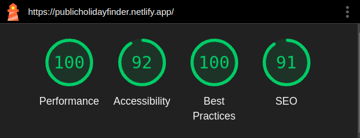

# public-holiday-finder

## Description

Live version: https://publicholidayfinder.netlify.app/

This project is a public holiday finder. It allows you to find public holidays and extra information about a country.

## Features

- Search countries by name in the search bar or by clicking on the country in the world map.
- Have dynamic and reactive components based on selected country.
- View country extra information (flag, map, borders, etc).
- Access details about each holiday, through links to Wikipedia.
- View holidays by year or upcoming holidays.
- Sort holidays by name or date.
- Save favorite countries for quick access at favorites page (accessible from the header).
- Toast notifications for when a country is added to favorites or removed from favorites.
- See a quick information about the application in a modal accessible from the header.
- Responsive design for mobile devices.

## Technologies

- Vue 3
- Vite
- SCSS
- TypeScript
- Pinia
- Vue Router

## Architecture

- Basic components: Can be reused accross the application. They are located in the `src/components/BasicComponents` folder.
- Components: Building blocks of the application, generally built with the basic components. They are located in the `src/components` folder.
- Layouts: Layouts are the structure of the application. They are located in the `src/components/layout` folder.
- Views: Are the pages view of the application. They are located in the `src/views` folder.
- Routes: Are the available routes of the application. They are located in the `src/router` folder.
- Stores: Used to manage the data state across the application with **Pinia**. They are located in the `src/stores` folder. To avoid unnecessary requests to the API, a cache mechanism is implemented, always saving the already accessed data `in memory` and `local storage`.
- Utils: Are the utility functions/classes that the application uses. They are located in the `src/utils` folder.
- Types: Are the types used in the application. They are located in the `src/types` folder.

## Google Lighthouse testing



## Project Setup

Environment:

- node: 22.12.0 (LTS)
- npm: 10.9.0

```sh
npm install
```

### Compile and Hot-Reload for Development

```sh
npm run dev
```

### Type-Check, Compile and Minify for Production

```sh
npm run build
```

### Lint with [ESLint](https://eslint.org/)

```sh
npm run lint
```
